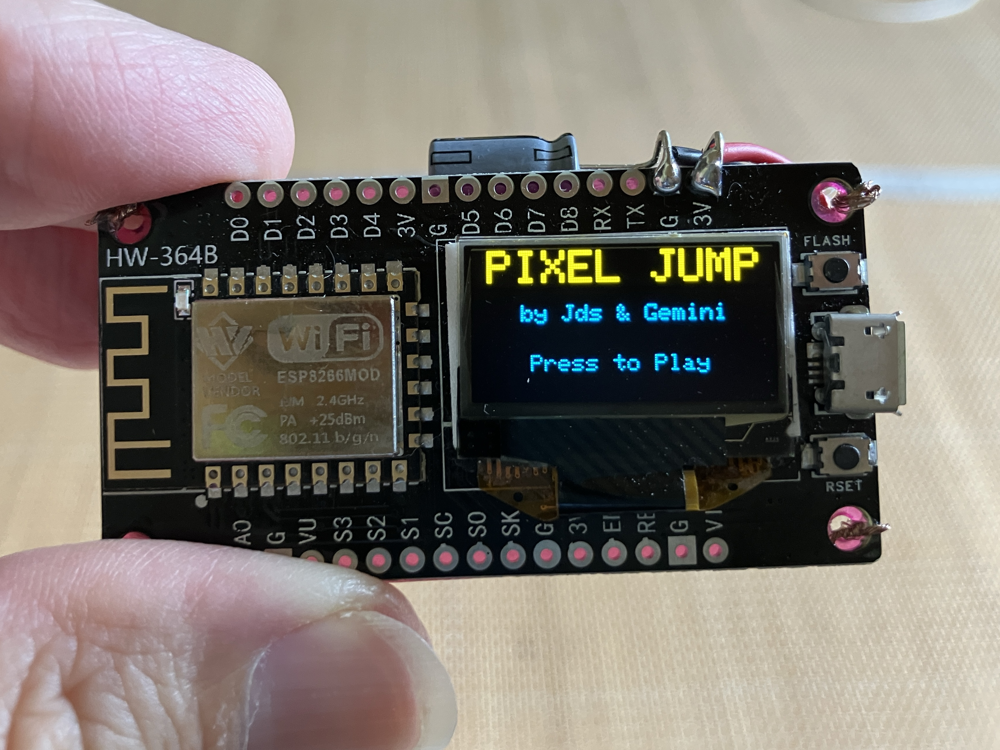
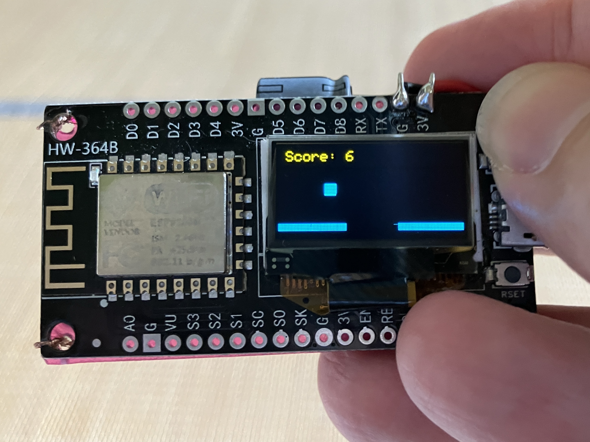
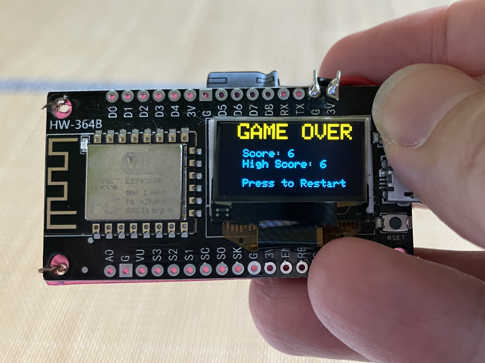

# Pixel Jump
A simple side-scrolling game for the HW-364a and HW-364b (ESP8266 development boards)

How to Play:
* Press the FLASH button to start the game.
* Press the FLASH to jump over the gaps in the scrolling floor.
* Hold the FLASH button to jump higher.
* That's it!

<table style="width: 80%;">
  <tr>
    <td width="50%">
      
    </td>
    <td width="50%">
      
    </td>
    <td width="50%">
      
    </td>
  </tr>
</table>

